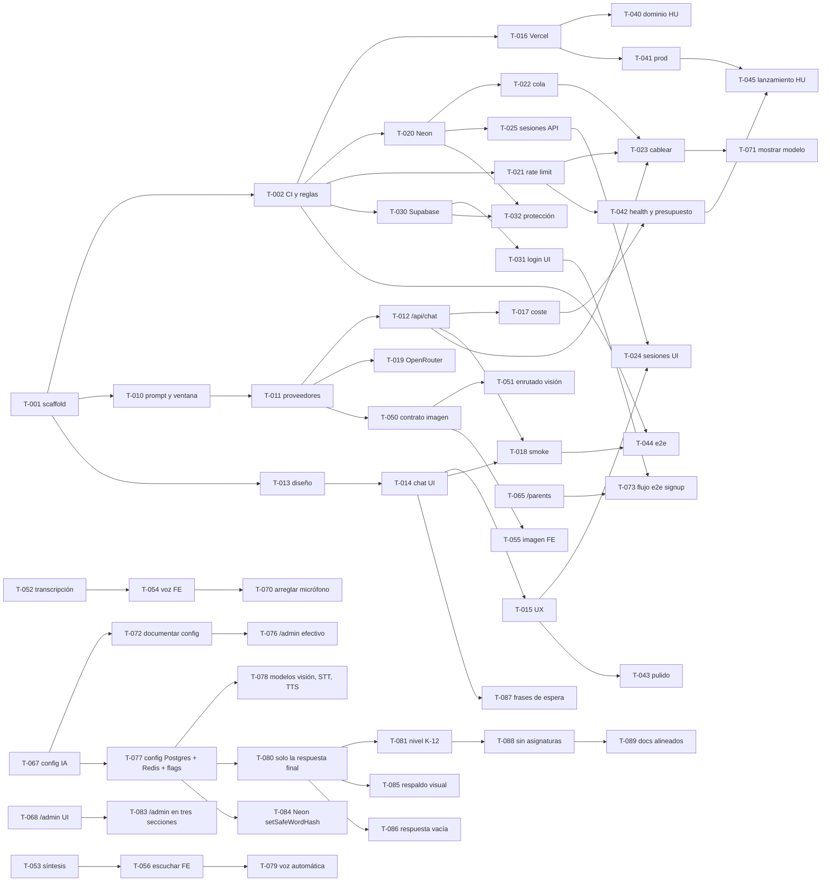

# Roadmap — ELI

> Cómo llegamos del repo vacío a `https://eli.ngo`. Los hitos se cierran en orden, pero **dentro de cada hito los carriles Frontend (FE), Backend (BE) y Data/Ops (DO) avanzan en paralelo**. El detalle ejecutable de cada tarea está en `tasks.md`; aquí está el mapa.

## Cómo leer este documento

- **Hito**: bloque con objetivo y criterio de salida verificable en `main`.
- **Carriles**: FE = Frontend, BE = Backend, DO = Data/Ops, HU = humano (el propietario del proyecto).
- **Regla de cierre**: un hito está cerrado cuando todas sus tareas no-`HU` están `done` en `tasks.md` y el criterio de salida se cumple en `main`.
- **Regla de paralelismo**: las tareas de un hito posterior pueden empezar en cuanto sus dependencias concretas estén `done`, aunque el hito anterior no esté cerrado del todo.

## Vista rápida

| Hito | Objetivo | Criterio de salida | Tareas |
|---|---|---|---|
| M0 Bootstrap | Repo construible con CI y reglas de merge | `pnpm check` verde en CI; un PR fusionado por auto-merge | T-001, T-002 (T-000 HU en paralelo) |
| M1 Vertical slice | Una niña puede chatear con ELI (mock o Anthropic) en una URL de preview | Preview en Vercel con chat funcional; `pnpm smoke` verde | T-010 … T-019 |
| M2 Datos y estado | Historial persistido y abuso controlado | Mensajes en Neon vía cola; 429 al superar el límite; historial recargable | T-020 … T-025 |
| M3 Auth | Cuentas de padres y alumno | Login y registro; `/chat` protegido con `AUTH_REQUIRED=true`; sesiones ligadas a usuario | T-030 … T-032 |
| M4 Producción | `https://eli.ngo` operativo y vigilado | Dominio activo; `/api/health` ok; presupuesto diario; e2e en CI; checklist firmada | T-040 … T-045 |
| M5 Extras | Valor añadido tras la demo | — | Bandeja de `tasks.md` (estado `new`) |
| M6 Multimodal | Voz e imagen en el chat, arquitectura simple | PR único fusionado; `/chat` acepta voz e imagen con fallback local | T-050 … T-056 |
| M7 Familias y administración | Panel de padres con palabra segura, flags por familia, panel de administración | PR único fusionado; `/parents` y `/admin` funcionan y `/chat` respeta los flags | T-060 … T-069 |
| M8 Calidad y visibilidad | Bugfixes (micrófono), mostrar modelo activo en el chat, verificar admin y auth | PR único fusionado; micrófono funciona, modelo visible en chat, `/admin` operativo, signup/login validados | T-070 … T-075 |
| M9 Configuración, modelos y calidad | Configuración en Postgres con caché Redis, flags por cuenta, modelos gratuitos de chat/visión/voz con respaldo, K-12, sin asignaturas, tareas bilingües | Cambios de modelo y flags sin redeploy; el chat nunca muestra razonamiento y sobrevive a un modelo caído; pregunta hablada → respuesta con voz | T-076 … T-089 |

## M0 — Bootstrap (secuencial)

**Objetivo**: que exista un proyecto que compila, se prueba y se fusiona solo.

| Carril | Tareas |
|---|---|
| BE | T-001 scaffold Next.js 16 + tooling + `pnpm check` + `.env.example` + `vercel.json` + tipos de contratos + stubs con fallback local |
| DO | T-002 CI en GitHub Actions + auto-merge + ruleset de `main` con el check `check` requerido |
| HU | T-000 claves y cuentas (no bloquea: todo funciona con mocks) |

**Criterio de salida**: `pnpm check` verde en CI sobre `main`; el PR de T-002 se ha fusionado por auto-merge; `tasks.md` marca T-001 y T-002 como `done`.

**Notas**: T-001 es la única tarea que se sube directamente a `main` (aún no hay CI). Todo lo demás va por PR. Nadie empieza otra tarea hasta que T-001 esté en `main`.

## M1 — Vertical slice (3 carriles)

**Objetivo**: el flujo completo "problema → guía socrática en streaming" funcionando de punta a punta, con mock cuando no hay clave.

| Carril | Tareas |
|---|---|
| BE | T-010 prompt ELI + ventana deslizante → T-011 proveedores Anthropic/mock + `ai.service` → T-012 `POST /api/chat` en streaming → T-017 guardas de coste → T-018 smoke test → T-019 proveedor OpenRouter |
| FE | T-013 tokens de diseño y layout → T-014 UI de chat con hook de streaming → T-015 UX infantil (chips, markdown seguro, móvil, a11y, estados) |
| DO | T-016 proyecto en Vercel, conexión con GitHub, env de preview con mock, primer deploy |

**Criterio de salida**: URL de preview en Vercel donde se puede chatear con el mock (y con Fable 5.1 si hay clave); `pnpm smoke` verde; el test de "trampa" demuestra que ELI no da la respuesta.

**Riesgo principal**: latencia de Fable 5.1 (el razonamiento está siempre activo). Mitigación: `ANTHROPIC_EFFORT=low`, salidas cortas, indicador de "ELI está pensando…" desde el primer instante.

## M2 — Datos y estado (3 carriles)

**Objetivo**: guardar el historial completo sin frenar el chat y evitar el abuso.

| Carril | Tareas |
|---|---|
| DO | T-020 Neon + Drizzle + migraciones SQL (repositorio en memoria sin `DATABASE_URL`) → T-022 cola QStash con endpoint idempotente; T-021 rate limit con Upstash (fallback en memoria) |
| BE | T-023 cablear rate limit y persistencia asíncrona en `/api/chat`; T-025 `GET /api/sessions` y `GET /api/sessions/:id` |
| FE | T-024 sesión en cliente, "Nueva conversación", lista y carga del historial |

**Criterio de salida**: cada mensaje acaba en `messages` de Neon sin que el chat espere; el mensaje 21 en 10 minutos recibe un 429 amable; al recargar la página se recupera la conversación.

## M3 — Auth (3 carriles)

**Objetivo**: cuentas de padres y alumno sin rehacer el chat.

| Carril | Tareas |
|---|---|
| DO | T-030 clientes Supabase SSR + middleware de sesión + bandera `AUTH_REQUIRED` |
| FE | T-031 login, registro, perfil de alumno, logout |
| BE | T-032 protección de `/chat` y `/api/*`, upsert de `users` en Neon, sesiones ligadas a `userId` |

**Criterio de salida**: con `AUTH_REQUIRED=true` nadie chatea sin sesión; con `false` todo sigue funcionando en anónimo; un usuario ve solo sus conversaciones.

## M4 — Producción (mixto)

**Objetivo**: `https://eli.ngo` en producción, vigilado y con el gasto bajo control.

| Carril | Tareas |
|---|---|
| HU | T-040 dominio `eli.ngo` (titularidad, DNS) · T-045 checklist de lanzamiento y prueba con una alumna real |
| DO | T-041 env vars de producción, `vercel.json`, cabeceras de seguridad, `robots.txt` |
| BE | T-042 `/api/health`, errores centralizados, presupuesto diario de tokens · T-044 e2e con Playwright en CI |
| FE | T-043 pulido visual, favicon/OG, contraste, animaciones sutiles |

**Criterio de salida**: los ocho criterios de éxito de `north_star.md` se cumplen en `eli.ngo`.

## M5 — Extras (opcional)

Historial para padres, selector de asignatura persistente, rachas, foto del problema (Supabase Storage + visión), migración de sesiones anónimas al iniciar sesión, evals del prompt. Viven en la Bandeja de `tasks.md` con estado `new` hasta que el humano las promueva a `todo`.

## M6 — Multimodal (mixto)

**Objetivo**: ELI entiende voz y fotos además de texto, y puede leer sus respuestas en voz alta, sin complicar la arquitectura: `voz/imagen → texto/visión → tutor socrático → texto → voz opcional`. Push-to-talk, nunca conversación continua: la ganancia percibida de un agente de voz en tiempo real con una fracción de su complejidad.

| Carril | Tareas |
|---|---|
| BE | T-050 contrato de imagen → T-051 enrutado a modelo de visión (Anthropic nativo / `OPENROUTER_VISION_MODEL`) + nuevo valor por defecto de `OPENROUTER_MODEL`; T-052 transcripción (OpenRouter Whisper); T-053 síntesis de voz (Fish Audio) |
| FE | T-054 entrada de voz (`SpeechRecognition`, fallback grabación+Whisper); T-055 entrada de imagen (cámara/adjuntar, comprimida en cliente); T-056 salida de voz ("Escuchar", fallback `speechSynthesis`) |

**Criterio de salida**: en `/chat`, una alumna puede dictar su pregunta, adjuntar una foto de su problema y pulsar "Escuchar" en una respuesta de ELI; todo funciona sin ninguna clave nueva (navegador nativo o mock) y mejora con clave (Fish Audio, OpenRouter); `pnpm check` verde.

**Nota de proceso**: a diferencia de M1-M5, este hito se ejecuta en **una sola rama y un solo PR** (`agent/M6-multimodal`) por instrucción directa del humano, con sub-agentes en modelos económicos escribiendo tramos disjuntos del código bajo supervisión, en vez del enjambre habitual de un agente/rama/PR por tarea.

> **Actualizado en M9**: los modelos concretos de esta sección (DeepSeek, Ling, Whisper por defecto, Fish Audio directo) cambiaron; los vigentes están en `tasks.md` 6.13 y en `north_star.md`. «Escuchar» sigue siendo manual salvo cuando la petición fue hablada (T-079).

**Riesgo principal**: los modelos gratuitos de OpenRouter (DeepSeek V4 Flash, Ling 3.0 Flash VL) y la ventana gratuita de Fish Audio pueden cambiar límites, precio o desaparecer sin aviso — OpenRouter lo advierte explícitamente para sus modelos `:free`. Mitigación: todo es configurable por variable de entorno con fallback local (`speechSynthesis`, `SpeechRecognition`, mock); la producción no depende de que ninguno de ellos siga gratis.

## M7 — Familias y administración (mixto)

**Objetivo**: quien se registra puede fijar una "palabra segura" que protege `/parents` (informe de actividad y los flags `allowImages`/`allowVoice`/`allowText` del chat); `/admin`, accesible solo a `ADMIN_EMAILS`, permite ver usuarios y cambiar el proveedor/modelo de IA en caliente sin redeploy.

**Decisión de producto** (aclarada con el humano antes de empezar): no hay cuentas de hijo/a separadas. Un único perfil por familia — quien se registra inicia sesión en cualquier dispositivo (tablet, móvil, portátil) y usa esa misma sesión para estudiar; la palabra segura es solo la puerta para entrar en `/parents` a ver informes y cambiar ajustes, no una segunda cuenta.

| Carril | Tareas |
|---|---|
| DO | T-060 esquema: `users.safeWordHash`/`allowImages`/`allowVoice`/`allowText`, tabla `app_config` (config de IA en caliente) |
| BE | T-061 palabra segura (hash/verifica, `crypto.scrypt`, sin dependencia nueva) + desbloqueo de sesión → T-062 ajustes (flags) → T-063 los flags se hacen cumplir en `/api/chat`, `/api/speech`, `/api/transcribe` → T-064 informes heurísticos (sin llamadas nuevas a IA; desde T-088, un único resumen de actividad, sin desglose por asignatura) → T-066 `ADMIN_EMAILS` + listar usuarios → T-067 config de IA en caliente (`app_config`, con fallback seguro a las env vars si falla) |
| FE | T-065 página `/parents` (puerta + ajustes + informes) → T-068 página `/admin` (usuarios + selector de proveedor/modelo) → T-069 `/chat` oculta micrófono/cámara según los flags |

**Criterio de salida**: con `SUPABASE_*` configurado, alguien se registra, fija su palabra segura, entra en `/parents`, ve un resumen de actividad y apaga "permitir imágenes"; `/chat` deja de mostrar el botón de cámara para esa cuenta; una cuenta en `ADMIN_EMAILS` entra en `/admin` y cambia el modelo activo sin tocar Vercel. Todo sigue funcionando sin ninguna clave nueva (sin Supabase, `/parents` y `/admin` no son alcanzables y el chat anónimo sigue igual que hoy).

**Riesgos**: primera migración de esquema desde T-020; se genera y versiona con `drizzle-kit generate` pero aplicarla a Neon de producción (`pnpm db:migrate` con el `DATABASE_URL` real) es un paso humano, no se ejecuta aquí. El "config de IA en caliente" de T-067 nunca sustituye la restricción de `tasks.md` §4 sobre cambiar el modelo de producción fuera de T-045: es human-in-the-loop por diseño (un admin autenticado decide, no un agente).

## M8 — Calidad y visibilidad (mixto)

**Objetivo**: arreglar bugs encontrados en M7, hacer visible el modelo activo en el chat, verificar que `/admin` y el flujo de signup/login funcionan end-to-end.

| Carril | Tareas |
|---|---|
| FE | T-070 arreglar icono de micrófono (bug en `useSpeechInput`) → T-071 mostrar modelo activo en la burbuja de sistema |
| BE | T-072 verificar y documentar `/api/admin/config` en la sección 6 de `tasks.md` |
| FE | T-073 flujo end-to-end de signup → login → `/parents` → cambiar ajustes → `/chat` |

**Criterio de salida**: un PR único fusionado con todos los bugfixes; micrófono funciona sin quedarse visualmente en "escuchando"; el modelo actual se muestra en el chat (en la burbuja del sistema inicial o en un header); `/admin` permite cambiar el modelo y se aplica en caliente; signup/login/parents/chat funcionan en secuencia sin errores.

**Riesgos**: mínimos. Son refinamientos sobre código ya testeado en M7. La única novedad es la visibilidad del modelo, que es display-only.

## M9 — Configuración, modelos y calidad (mixto)

**Objetivo**: que lo ajustable se cambie sin redeploy, que ELI sea fiable con modelos gratuitos que se caen o se cuelgan, y que el producto siga las reglas del propietario (`north_star.md`, «Reglas de producto»): K-12, sin asignaturas, tareas en español o inglés, solo la respuesta final, voz que contesta con voz.

| Carril | Tareas |
|---|---|
| DO | T-077 configuración en Postgres (`app_config`, `account_flags`) con caché Redis y feature flags por cuenta; T-084 `setSafeWordHash` en Neon (hallado al ejecutar la batería contra una base real) |
| BE | T-076 `/admin` muestra el proveedor y el modelo efectivos → T-078 modelos de visión, STT y TTS por OpenRouter con respaldo → T-080 solo la respuesta final (filtro de razonamiento, respaldo y tiempo de espera) → T-081 nivel K-12 en el prompt · T-085 respaldo visual · T-086 una respuesta vacía cuenta como fallo · T-088 sin asignaturas y tareas bilingües |
| FE | T-079 voz automática cuando la petición fue hablada · T-083 `/admin` en tres secciones · T-087 frases amables que rotan en «ELI está pensando…» |
| Docs | T-089 `north_star.md`, roadmap, `tasks.md`, README y `CLAUDE.md` alineados con estas decisiones |

**Criterio de salida**: en `main`, un administrador cambia un modelo o apaga voz/imagen desde `/admin` y el siguiente chat ya lo usa; con un modelo gratuito caído (429, 503, cuelgue, respuesta vacía o razonamiento filtrado) la niña recibe la respuesta de un modelo de respaldo o un aviso amable, nunca razonamiento ni un cuerpo vacío; tras una pregunta hablada, la respuesta se lee sola; no queda ninguna asignatura en la UI ni en la API; `pnpm check` verde.

**Riesgos**:
- Los modelos `:free` de OpenRouter comparten cuota con todos sus usuarios (429) y a veces se degradan (latencia de decenas de segundos, 503, respuestas vacías): por eso cada modelo tiene respaldo, un tiempo máximo hasta el primer texto (20 s) y una clave propia de Google se puede conectar en OpenRouter. Los modelos por defecto se eligen midiendo latencia y disponibilidad, no por el nombre.
- **Deriva de esquema**: producción llegó a tener un historial de migraciones distinto del repo y `/api/chat` falló para toda cuenta con sesión. El CI no tiene base de datos, así que la batería del repositorio contra Neon no corre allí (pendiente: rama efímera de Neon en el CI). Una migración de producción se ensaya antes en una copia y se anota en el libro de Drizzle.
- Sin verificar todavía con un modelo real: la calidad de las respuestas en inglés y la adaptación por grado.

## Grafo de dependencias



## Cómo ejecutar el enjambre

### Ronda 0 (una sola vez)

Un único agente `backend` ejecuta T-001. Nadie más trabaja hasta que T-001 esté en `main` y el worktree principal haya hecho `git pull`.

### Rondas siguientes

Tres agentes en paralelo, uno por rol, cada uno en su propio worktree. Cada agente ejecuta **una** tarea y termina. Al acabar la ronda: `git pull --ff-only` en el worktree principal y se repite.

**Desde una sesión de Claude Code en este repo** (el orquestador), pega:

```text
Lanza en paralelo tres sub-agentes — frontend, backend y data-ops — con isolation "worktree" y este prompt exacto:
"Pick the single highest-leverage next step toward the goal and execute it, then update tasks.md."
Cuando los tres terminen, ejecuta git pull --ff-only y repite la ronda. Para cuando ningún agente encuentre tareas desbloqueadas.
```

**Desde terminal, con sesiones independientes** (una por rol):

```bash
git worktree add --detach ../elingo-be origin/main
cd ../elingo-be && claude -p "Actúa como el agente definido en .claude/agents/backend.md. Pick the single highest-leverage next step toward the goal and execute it, then update tasks.md."
```

Repite con `frontend` y `data-ops` en `../elingo-fe` y `../elingo-do`. Para rondas recurrentes desde una sesión interactiva se puede usar `/loop` con el prompt del orquestador.

### Reglas de la ronda

- Una tarea por agente y ronda. El lock es la rama `agent/T-0xx-*` publicada en `origin`.
- El humano solo hace tareas `HU`, revisa PRs si quiere y promueve tareas de la Bandeja. **No fusiona PRs de agentes a mano**: auto-merge lo hace cuando la tarea está completa y CI en verde; fusionar un PR «in progress» borra el lock del agente y deja la tarea a medias (pasó con #2, #5 y #6).
- Si un PR lleva más de 15 minutos sin fusionarse, el agente lo marca `blocked` y lo explica; el orquestador decide.
- Las tareas `HU` no bloquean el trabajo de los agentes: cada servicio externo tiene fallback local.

## Riesgos conocidos y mitigaciones

| Riesgo | Mitigación |
|---|---|
| Latencia y coste de Fable 5.1 (razonamiento siempre activo, $10/$50 por millón de tokens) | `effort: low`, salidas cortas, ventana de 6 pares, presupuesto diario, mock en dev y CI |
| Los modelos gratuitos se degradan, se cuelgan o muestran su razonamiento | Respaldo por modelo (texto y foto por separado), tiempo máximo de 20 s hasta el primer texto, filtro de razonamiento, respuesta vacía = intento fallido; ver M9 |
| El esquema de producción se desalinea del repo (el CI no tiene base de datos) | Ensayar la migración en una copia de Neon, rama de respaldo, transacción atómica y anotar en el libro de Drizzle; ver M9 |
| El prompt de sistema es corto (~200 tokens) y no llega al mínimo cacheable | `cache_control` se deja puesto y se verifica con `usage.cache_read_input_tokens`; añadir ejemplos few-shot si compensa |
| Dos agentes editan `tasks.md` a la vez | Cada agente toca solo su fila; `.gitattributes` con `tasks.md merge=union`; rebase antes del PR |
| Auto-merge requiere reglas en `main` | T-002 crea el ruleset antes de abrir su PR; hasta entonces se usa `gh pr merge --squash` directo |
| Provisionar Neon/Upstash desde el Marketplace de Vercel exige aceptar términos | Solo el humano ejecuta `vercel integration accept-terms`; los agentes provisionan después o usan los fallbacks |
| El dominio `.ngo` exige validación de ONG | T-040 es humana y no bloquea el resto; la app vive en `*.vercel.app` mientras tanto |
| Vercel compila con Node 24 y en local hay Node 26 | `engines.node >= 24` y sin APIs exclusivas de Node 26 |
