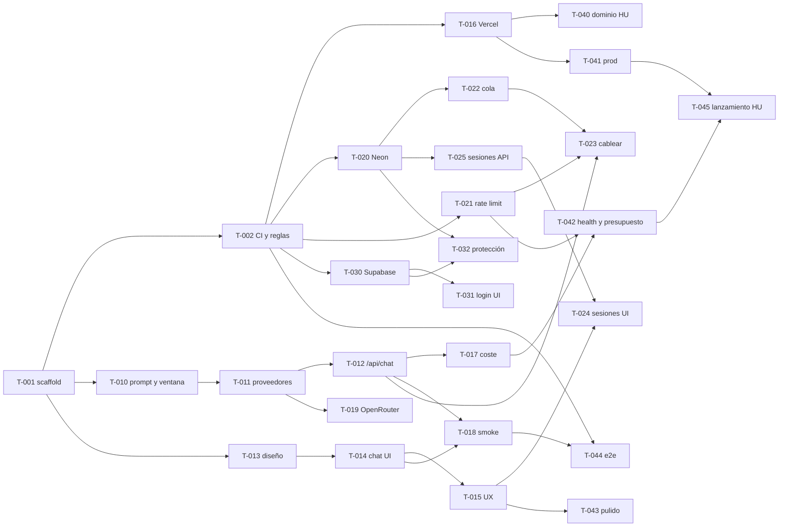

# Roadmap — ELI

> Cómo llegamos del repo vacío a `https://eli.ngo`. Los hitos se cierran en orden, pero **dentro de cada hito los carriles Frontend (FE), Backend (BE) y Data/Ops (DO) avanzan en paralelo**. El detalle ejecutable de cada tarea está en `tasks.md`; aquí está el mapa.

## Cómo leer este documento

- **Hito**: bloque con objetivo y criterio de salida verificable en `main`.
- **Carriles**: FE = Frontend, BE = Backend, DO = Data/Ops, HU = humano (el propietario del proyecto).
- **Regla de cierre**: un hito está cerrado cuando todas sus tareas no-`HU` están `done` en `tasks.md` y el criterio de salida se cumple en `main`.
- **Regla de paralelismo**: las tareas de un hito posterior pueden empezar en cuanto sus dependencias concretas estén `done`, aunque el hito anterior no esté cerrado del todo.

## Vista rápida

| Hito | Objetivo | Criterio de salida | Tareas |
|---|---|---|---|
| M0 Bootstrap | Repo construible con CI y reglas de merge | `pnpm check` verde en CI; un PR fusionado por auto-merge | T-001, T-002 (T-000 HU en paralelo) |
| M1 Vertical slice | Una niña puede chatear con ELI (mock o Anthropic) en una URL de preview | Preview en Vercel con chat funcional; `pnpm smoke` verde | T-010 … T-019 |
| M2 Datos y estado | Historial persistido y abuso controlado | Mensajes en Neon vía cola; 429 al superar el límite; historial recargable | T-020 … T-025 |
| M3 Auth | Cuentas de padres y alumno | Login y registro; `/chat` protegido con `AUTH_REQUIRED=true`; sesiones ligadas a usuario | T-030 … T-032 |
| M4 Producción | `https://eli.ngo` operativo y vigilado | Dominio activo; `/api/health` ok; presupuesto diario; e2e en CI; checklist firmada | T-040 … T-045 |
| M5 Extras | Valor añadido tras la demo | — | Bandeja de `tasks.md` (estado `new`) |

## M0 — Bootstrap (secuencial)

**Objetivo**: que exista un proyecto que compila, se prueba y se fusiona solo.

| Carril | Tareas |
|---|---|
| BE | T-001 scaffold Next.js 16 + tooling + `pnpm check` + `.env.example` + `vercel.json` + tipos de contratos + stubs con fallback local |
| DO | T-002 CI en GitHub Actions + auto-merge + ruleset de `main` con el check `check` requerido |
| HU | T-000 claves y cuentas (no bloquea: todo funciona con mocks) |

**Criterio de salida**: `pnpm check` verde en CI sobre `main`; el PR de T-002 se ha fusionado por auto-merge; `tasks.md` marca T-001 y T-002 como `done`.

**Notas**: T-001 es la única tarea que se sube directamente a `main` (aún no hay CI). Todo lo demás va por PR. Nadie empieza otra tarea hasta que T-001 esté en `main`.

## M1 — Vertical slice (3 carriles)

**Objetivo**: el flujo completo "problema → guía socrática en streaming" funcionando de punta a punta, con mock cuando no hay clave.

| Carril | Tareas |
|---|---|
| BE | T-010 prompt ELI + ventana deslizante → T-011 proveedores Anthropic/mock + `ai.service` → T-012 `POST /api/chat` en streaming → T-017 guardas de coste → T-018 smoke test → T-019 proveedor OpenRouter |
| FE | T-013 tokens de diseño y layout → T-014 UI de chat con hook de streaming → T-015 UX infantil (chips, markdown seguro, móvil, a11y, estados) |
| DO | T-016 proyecto en Vercel, conexión con GitHub, env de preview con mock, primer deploy |

**Criterio de salida**: URL de preview en Vercel donde se puede chatear con el mock (y con Fable 5.1 si hay clave); `pnpm smoke` verde; el test de "trampa" demuestra que ELI no da la respuesta.

**Riesgo principal**: latencia de Fable 5.1 (el razonamiento está siempre activo). Mitigación: `ANTHROPIC_EFFORT=low`, salidas cortas, indicador de "ELI está pensando…" desde el primer instante.

## M2 — Datos y estado (3 carriles)

**Objetivo**: guardar el historial completo sin frenar el chat y evitar el abuso.

| Carril | Tareas |
|---|---|
| DO | T-020 Neon + Drizzle + migraciones SQL (repositorio en memoria sin `DATABASE_URL`) → T-022 cola QStash con endpoint idempotente; T-021 rate limit con Upstash (fallback en memoria) |
| BE | T-023 cablear rate limit y persistencia asíncrona en `/api/chat`; T-025 `GET /api/sessions` y `GET /api/sessions/:id` |
| FE | T-024 sesión en cliente, "Nueva conversación", lista y carga del historial |

**Criterio de salida**: cada mensaje acaba en `messages` de Neon sin que el chat espere; el mensaje 21 en 10 minutos recibe un 429 amable; al recargar la página se recupera la conversación.

## M3 — Auth (3 carriles)

**Objetivo**: cuentas de padres y alumno sin rehacer el chat.

| Carril | Tareas |
|---|---|
| DO | T-030 clientes Supabase SSR + middleware de sesión + bandera `AUTH_REQUIRED` |
| FE | T-031 login, registro, perfil de alumno, logout |
| BE | T-032 protección de `/chat` y `/api/*`, upsert de `users` en Neon, sesiones ligadas a `userId` |

**Criterio de salida**: con `AUTH_REQUIRED=true` nadie chatea sin sesión; con `false` todo sigue funcionando en anónimo; un usuario ve solo sus conversaciones.

## M4 — Producción (mixto)

**Objetivo**: `https://eli.ngo` en producción, vigilado y con el gasto bajo control.

| Carril | Tareas |
|---|---|
| HU | T-040 dominio `eli.ngo` (titularidad, DNS) · T-045 checklist de lanzamiento y prueba con una alumna real |
| DO | T-041 env vars de producción, `vercel.json`, cabeceras de seguridad, `robots.txt` |
| BE | T-042 `/api/health`, errores centralizados, presupuesto diario de tokens · T-044 e2e con Playwright en CI |
| FE | T-043 pulido visual, favicon/OG, contraste, animaciones sutiles |

**Criterio de salida**: los ocho criterios de éxito de `north_star.md` se cumplen en `eli.ngo`.

## M5 — Extras (opcional)

Historial para padres, selector de asignatura persistente, rachas, foto del problema (Supabase Storage + visión), migración de sesiones anónimas al iniciar sesión, evals del prompt. Viven en la Bandeja de `tasks.md` con estado `new` hasta que el humano las promueva a `todo`.

## Grafo de dependencias



## Cómo ejecutar el enjambre

### Ronda 0 (una sola vez)

Un único agente `backend` ejecuta T-001. Nadie más trabaja hasta que T-001 esté en `main` y el worktree principal haya hecho `git pull`.

### Rondas siguientes

Tres agentes en paralelo, uno por rol, cada uno en su propio worktree. Cada agente ejecuta **una** tarea y termina. Al acabar la ronda: `git pull --ff-only` en el worktree principal y se repite.

**Desde una sesión de Claude Code en este repo** (el orquestador), pega:

```text
Lanza en paralelo tres sub-agentes — frontend, backend y data-ops — con isolation "worktree" y este prompt exacto:
"Pick the single highest-leverage next step toward the goal and execute it, then update tasks.md."
Cuando los tres terminen, ejecuta git pull --ff-only y repite la ronda. Para cuando ningún agente encuentre tareas desbloqueadas.
```

**Desde terminal, con sesiones independientes** (una por rol):

```bash
git worktree add --detach ../elingo-be origin/main
cd ../elingo-be && claude -p "Actúa como el agente definido en .claude/agents/backend.md. Pick the single highest-leverage next step toward the goal and execute it, then update tasks.md."
```

Repite con `frontend` y `data-ops` en `../elingo-fe` y `../elingo-do`. Para rondas recurrentes desde una sesión interactiva se puede usar `/loop` con el prompt del orquestador.

### Reglas de la ronda

- Una tarea por agente y ronda. El lock es la rama `agent/T-0xx-*` publicada en `origin`.
- El humano solo hace tareas `HU`, revisa PRs si quiere y promueve tareas de la Bandeja. **No fusiona PRs de agentes a mano**: auto-merge lo hace cuando la tarea está completa y CI en verde; fusionar un PR «in progress» borra el lock del agente y deja la tarea a medias (pasó con #2, #5 y #6).
- Si un PR lleva más de 15 minutos sin fusionarse, el agente lo marca `blocked` y lo explica; el orquestador decide.
- Las tareas `HU` no bloquean el trabajo de los agentes: cada servicio externo tiene fallback local.

## Riesgos conocidos y mitigaciones

| Riesgo | Mitigación |
|---|---|
| Latencia y coste de Fable 5.1 (razonamiento siempre activo, $10/$50 por millón de tokens) | `effort: low`, salidas cortas, ventana de 6 pares, presupuesto diario, mock en dev y CI |
| El prompt de sistema es corto (~200 tokens) y no llega al mínimo cacheable | `cache_control` se deja puesto y se verifica con `usage.cache_read_input_tokens`; añadir ejemplos few-shot si compensa |
| Dos agentes editan `tasks.md` a la vez | Cada agente toca solo su fila; `.gitattributes` con `tasks.md merge=union`; rebase antes del PR |
| Auto-merge requiere reglas en `main` | T-002 crea el ruleset antes de abrir su PR; hasta entonces se usa `gh pr merge --squash` directo |
| Provisionar Neon/Upstash desde el Marketplace de Vercel exige aceptar términos | Solo el humano ejecuta `vercel integration accept-terms`; los agentes provisionan después o usan los fallbacks |
| El dominio `.ngo` exige validación de ONG | T-040 es humana y no bloquea el resto; la app vive en `*.vercel.app` mientras tanto |
| Vercel compila con Node 24 y en local hay Node 26 | `engines.node >= 24` y sin APIs exclusivas de Node 26 |
